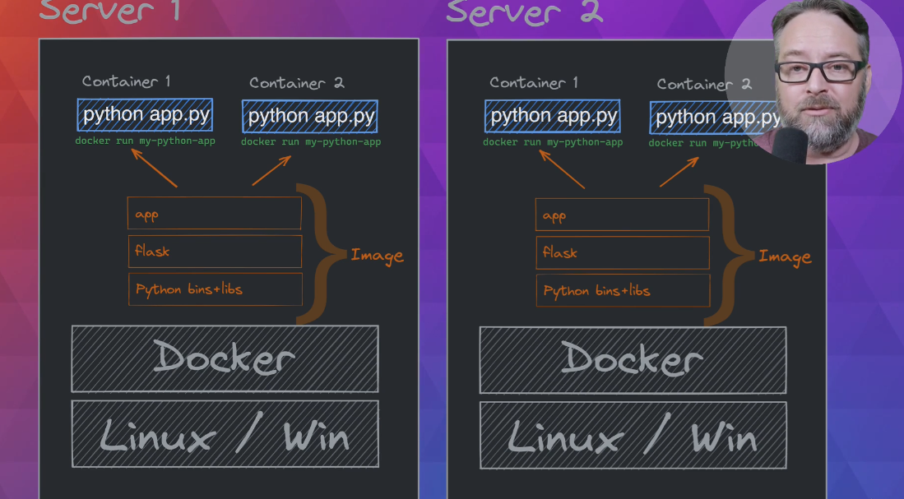

# Docker-plus-Kubernetes-Registry

Three pilars
- Docker Image (Build) - As a universal app manager(Cross OS, platform and language agnostic)
- Docker Container (Run) 
- Docker Registry (Ship) - Universal app distribution

## Docker Image
EXAMPLE DOCKERFILE
"""
FROM python
RUN pip install flask
WORKDIR /app
COPY ..
CMD python app.py
"""

Image layers of the previous dockerfile. Together this forms an image running **'docker build'**
- app
- flask
- python bins+libs

## Docker Registry
Machine one uses a image (which has a SHA Hash)
If you run command **'docker push'**. It will sent the image into a registry.
From another machine, you will be able to use **'docker pull'**

## Docker Container
There's a server with:
- OS (Linux/Win)
- Docker
- The image

You can run docker run <app-name> many times and will create containers like:

'''
docker version
docker run -d -p 8800:80 httpd
curl localhost:8800
docker ps
docker run -d -p 8801:80 httpd
'''